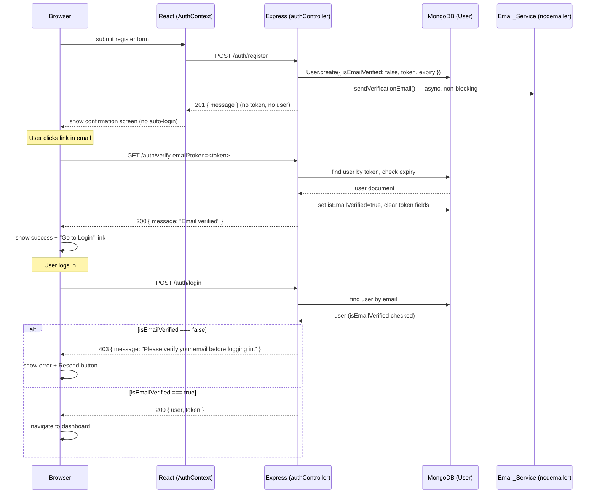

# Design Document — Email Verification

## Overview

This document describes the technical design for adding email verification to the AI Habit Tracker's existing JWT-based authentication system. The change affects four layers: the MongoDB User model, the Express auth controller, the auth routes, and the React frontend.

The core flow is:

1. User registers → account created with `isEmailVerified: false` → verification email sent (non-blocking) → HTTP 201 returned.
2. User clicks link in email → `GET /auth/verify-email?token=<token>` → account verified → frontend shows success.
3. User tries to log in before verifying → HTTP 403 → frontend shows error + resend button.
4. User resends email → `POST /auth/resend-verification` → new token generated, email sent.

nodemailer is not currently installed in `server/package.json` and must be added.

---

## Architecture



---

## Components and Interfaces

### Backend

#### `server/utils/emailService.js` (new file)

Responsible for composing and sending all verification emails via nodemailer.

```
createTransport(SMTP config from env)

sendVerificationEmail(to: string, name: string, token: string): Promise<void>
  - Composes mailOptions (to, subject, html body with salutation and verification link)
  - Calls transporter.sendMail()
  - Throws on failure (caller handles the error)
```

Environment variables required:
- `SMTP_HOST`
- `SMTP_PORT`
- `SMTP_USER`
- `SMTP_PASS`
- `SMTP_FROM` (e.g. `"AI Habit Tracker <no-reply@yourdomain.com>"`)
- `FRONTEND_URL` (e.g. `https://yourdomain.com` — used to build the verification link)

#### `server/models/User.js` (modified)

Three new fields added to `userSchema`:

| Field | Type | Default | Notes |
|---|---|---|---|
| `isEmailVerified` | Boolean | `false` | Set to `true` after verification |
| `emailVerificationToken` | String | `null` | Hex string from `crypto.randomBytes(48)` (96 hex chars ≥ 64 chars, satisfies 128-bit requirement) |
| `emailVerificationTokenExpiry` | Date | `null` | `Date.now() + 24 * 60 * 60 * 1000` |

The `toJSON` method already strips `password`; it will also strip `emailVerificationToken` and `emailVerificationTokenExpiry` so they are never sent to the frontend.

#### `server/controllers/authController.js` (modified)

**`register` (modified)**
- Generate token: `crypto.randomBytes(48).toString('hex')` → 96-char string
- Create user with `isEmailVerified: false`, token, expiry
- Call `sendVerificationEmail()` in a try/catch — on failure log the error but do **not** reject the response
- Return `{ message: "Registration successful. Please check your email to verify your account." }` — **no JWT, no user object**

**`login` (modified)**
- After password check passes, check `user.isEmailVerified`
- If `false`: return `res.status(403).json({ message: "Please verify your email before logging in." })`
- If `true`: proceed with existing `signToken` + return user + token

**`verifyEmail` (new)**
- Read `token` from `req.query.token`
- If absent/blank: `400 { message: "Verification token is required." }`
- `User.findOne({ emailVerificationToken: token })`
- If no user: `400 { message: "Invalid or already used verification token." }`
- If `emailVerificationTokenExpiry < Date.now()`:
  - Clear token fields on user, save
  - `400 { message: "Verification token has expired. Please request a new one." }`
- Otherwise: set `isEmailVerified: true`, clear token fields, save
  - `200 { message: "Email verified successfully. You can now log in." }`

**`resendVerification` (new)**
- Read `email` from `req.body.email`
- If absent, blank, or longer than 254 chars: `400 { message: "A valid email address is required." }`
- `User.findOne({ email: email.toLowerCase() })`
- If no user: `404 { message: "No account found with that email address." }`
- If `user.isEmailVerified`: `400 { message: "This account is already verified." }`
- Rate-limit check: if `user.emailVerificationTokenExpiry` exists AND `(Date.now() - (user.emailVerificationTokenExpiry - 24h)) < 60_000` → `429 { message: "Please wait before requesting another verification email." }`
  - Practically: compute `tokenIssuedAt = user.emailVerificationTokenExpiry - 24 * 60 * 60 * 1000`. If `Date.now() - tokenIssuedAt < 60_000` → 429.
- Generate new token and expiry
- Try `sendVerificationEmail()`:
  - **On failure**: log error, return `502 { message: "Failed to send verification email. Please try again." }` — do **not** persist the new token
  - **On success**: save user with new token and expiry, return `200 { message: "Verification email sent. Please check your inbox." }`

#### `server/routes/auth.js` (modified)

Two new public routes (no `protect` middleware):

```
GET  /auth/verify-email        → verifyEmail
POST /auth/resend-verification → resendVerification
```

### Frontend

#### `AiHabitTracker/src/context/AuthContext.jsx` (modified)

The `register` function must **not** store a token or set the user after a successful registration:

```js
// Before (stores token and sets user):
const register = async (name, email, password) => {
  const res = await api.post("/auth/register", { name, email, password });
  localStorage.setItem("token", res.data.token);
  localStorage.setItem("user", JSON.stringify(res.data.user));
  setUser(res.data.user);
  return res.data.user;
};

// After (returns message only):
const register = async (name, email, password) => {
  const res = await api.post("/auth/register", { name, email, password });
  // Server no longer returns token/user — do not auto-login
  return res.data; // { message: "..." }
};
```

#### `AiHabitTracker/src/pages/Register.jsx` (modified)

Replace the current "navigate to dashboard on success" flow with a two-state component:

- **State 1 (form state):** Renders the existing registration form.
- **State 2 (confirmation state):** Shown after successful registration. Renders:
  - A success message: "A verification email has been sent to `{email}`."
  - A "Resend verification email" button.
  - On button click: calls `POST /auth/resend-verification`, shows success or error feedback.
  - Remove the `navigate("/dashboard")` call entirely.

Local state additions:
```js
const [registered, setRegistered] = useState(false);  // switches to confirmation view
const [resendStatus, setResendStatus] = useState("");  // success/error message for resend
const [resendLoading, setResendLoading] = useState(false);
```

#### `AiHabitTracker/src/pages/Login.jsx` (modified)

Additions to the existing component:

- Detect HTTP 403 specifically: `if (e.response?.status === 403)`
- Add local state: `const [is403, setIs403] = useState(false)` and `const [resendStatus, setResendStatus] = useState("")` and `const [resendLoading, setResendLoading] = useState(false)`
- When 403: set `is403 = true`, display the 403 message
- Render a "Resend verification email" button below the error block when `is403` is true
- Button behaviour:
  - Disable while loading
  - Call `POST /auth/resend-verification` with the email from the form field
  - On 200: show "Verification email sent"
  - On 429: show "Please wait before requesting another verification email."
  - On other error/network failure: show "Failed to send. Please try again."

#### `AiHabitTracker/src/pages/VerifyEmailPage.jsx` (new file)

New page component at route `/verify-email`. Reads `?token` from the URL.

States:
- `loading` — initial, shows spinner
- `success` — API returned 200, shows success message + "Go to Login" link
- `error` — API returned 400, shows API error message + "Resend verification email" link (to `/login`, which has the resend UI)
- `unexpected` — non-200/400 or network error, shows generic error + "Go to Login" link
- `noToken` — no `?token` param, shows "No verification token provided", redirects to `/login` after 3 seconds

On mount: call `GET /auth/verify-email?token=<token>`, handle each state above.

#### `AiHabitTracker/src/App.jsx` (modified)

Add the new public route:

```jsx
import VerifyEmailPage from "./pages/VerifyEmailPage.jsx";

// In <Routes>:
<Route path="/verify-email" element={<VerifyEmailPage />} />
```

---

## Data Models

### User document — updated schema

```js
{
  name:                         String,   // required, trimmed
  email:                        String,   // required, unique, lowercase
  password:                     String,   // hashed via bcrypt pre-save hook
  avatar:                       String,   // default ""
  morningMotivation:            Boolean,  // default true
  isEmailVerified:              Boolean,  // default false  ← NEW
  emailVerificationToken:       String,   // null after verification  ← NEW
  emailVerificationTokenExpiry: Date,     // null after verification  ← NEW
  createdAt:                    Date,     // from timestamps: true
  updatedAt:                    Date,     // from timestamps: true
}
```

`toJSON` strips: `password`, `emailVerificationToken`, `emailVerificationTokenExpiry`.

### Token generation

```js
import crypto from "crypto";

const token = crypto.randomBytes(48).toString("hex");
// → 96-character hex string
// entropy: 48 bytes = 384 bits >> 128-bit requirement in Req 9.1
// length:  96 chars >> 64-char minimum in Req 1.3 / 32-char minimum in Req 9.1
```

### Rate-limit logic

```js
// Stored on user when token is issued:
emailVerificationTokenExpiry = Date.now() + 24 * 60 * 60 * 1000

// On resend request:
const tokenIssuedAt = user.emailVerificationTokenExpiry.getTime() - 24 * 60 * 60 * 1000;
const secondsSinceIssue = (Date.now() - tokenIssuedAt) / 1000;
if (secondsSinceIssue < 60) → 429
```

---

## Correctness Properties

*A property is a characteristic or behavior that should hold true across all valid executions of a system — essentially, a formal statement about what the system should do. Properties serve as the bridge between human-readable specifications and machine-verifiable correctness guarantees.*

---

### Property 1: New user verification defaults

*For any* valid registration payload (any name, email, password combination), the User document created by `register` SHALL have `isEmailVerified === false`, a non-null `emailVerificationToken`, and a non-null `emailVerificationTokenExpiry`.

**Validates: Requirements 1.1, 1.2**

---

### Property 2: Token generation invariants

*For any* set of N ≥ 100 independently generated verification tokens, every token SHALL have length ≥ 64 characters, all N tokens SHALL be distinct from one another, and each token's associated expiry SHALL be within a 2-second window of `Date.now() + 24 * 60 * 60 * 1000` at generation time.

**Validates: Requirements 1.3, 9.1, 9.2**

---

### Property 3: Email composition correctness

*For any* user name, email address, and token, the email options object produced by `sendVerificationEmail` SHALL have its `to` field equal to the user's email address, SHALL contain the user's name in the body, and SHALL contain a URL of the form `<FRONTEND_URL>/verify-email?token=<token>` in the body.

**Validates: Requirements 2.2, 2.3**

---

### Property 4: Unverified users are blocked at login

*For any* user whose `isEmailVerified` is `false`, a login attempt with the correct password SHALL return HTTP 403 with the message "Please verify your email before logging in.", and SHALL NOT return a JWT token.

**Validates: Requirements 2.5, 4.1**

---

### Property 5: Verified users can log in

*For any* user whose `isEmailVerified` is `true`, a login attempt with the correct password SHALL return HTTP 200 with a valid JWT token and a user object that does not contain the password field.

**Validates: Requirements 4.2**

---

### Property 6: Successful verification is a one-time operation

*For any* user with a valid, non-expired `emailVerificationToken`, calling `GET /auth/verify-email?token=<token>` SHALL return HTTP 200, set `isEmailVerified` to `true`, and set both `emailVerificationToken` and `emailVerificationTokenExpiry` to null on the saved document. A subsequent call with the same token SHALL return HTTP 400.

**Validates: Requirements 3.2, 9.3, 9.4**

---

### Property 7: Invalid tokens are rejected

*For any* string that does not match any stored `emailVerificationToken`, calling `GET /auth/verify-email?token=<string>` SHALL return HTTP 400.

**Validates: Requirements 3.3**

---

### Property 8: Expired tokens are rejected and cleared

*For any* user whose `emailVerificationTokenExpiry` is in the past, calling `GET /auth/verify-email?token=<token>` SHALL return HTTP 400 and SHALL set both `emailVerificationToken` and `emailVerificationTokenExpiry` to null on the saved document, so the token cannot be reused.

**Validates: Requirements 3.4**

---

### Property 9: Resend replaces the old token

*For any* unverified user, calling `POST /auth/resend-verification` with their email (at least 61 seconds after the last token was issued) SHALL replace the stored token with a new, distinct token and update `emailVerificationTokenExpiry` to approximately 24 hours from the time of the resend request.

**Validates: Requirements 5.2**

---

### Property 10: Resend rate-limit is enforced

*For any* unverified user, making two consecutive `POST /auth/resend-verification` requests within 60 seconds SHALL result in the second request returning HTTP 429 with the message "Please wait before requesting another verification email."

**Validates: Requirements 5.5**

---

## Error Handling

### Backend error catalogue

| Scenario | HTTP status | Message |
|---|---|---|
| Missing token on verify-email | 400 | "Verification token is required." |
| Token not found in DB | 400 | "Invalid or already used verification token." |
| Token expired | 400 | "Verification token has expired. Please request a new one." |
| Login — invalid credentials | 401 | "Invalid email or password" |
| Login — valid credentials, unverified | 403 | "Please verify your email before logging in." |
| Resend — missing/invalid email | 400 | "A valid email address is required." |
| Resend — already verified | 400 | "This account is already verified." |
| Resend — email not found | 404 | "No account found with that email address." |
| Resend — rate limited | 429 | "Please wait before requesting another verification email." |
| Resend — email send failure | 502 | "Failed to send verification email. Please try again." |

### Email delivery failures

- During `register`: the email send is wrapped in `try/catch`. Failure is logged with `console.error` but does NOT affect the 201 response. The user record is already created with `isEmailVerified: false` and a valid token, so the user can resend via the confirmation screen.
- During `resendVerification`: the email send is attempted **before** saving the new token. If it throws, the controller returns 502 and the user's existing token is preserved unchanged. Only on successful send does the controller call `user.save()`.

### Frontend error handling

- Network errors (no response): treat the same as a server error (show a generic retry message).
- 403 on login: show the specific message + resend button.
- 429 on resend: show the rate-limit message, do not offer immediate retry.
- VerifyEmailPage: differentiate 200, 400, and everything else (including network failure) as distinct UI states.

---

## Testing Strategy

### Property-based testing

The property-based tests target the pure logic and data-layer functions. The recommended library is **fast-check** (works well in Node.js ESM projects).

Each property test runs a minimum of **100 iterations**.

Tag format used in test files: `// Feature: email-verification, Property N: <summary>`

Properties 1–10 map directly to test files in `server/__tests__/emailVerification.property.test.js`.

Suggested generators:
- Valid user payloads: arbitrary `name` (non-empty string), `email` (valid format string), `password` (≥ 6 chars)
- Token strings: arbitrary hex strings, random strings not matching stored tokens
- Time offsets: numbers representing milliseconds past/future

### Unit tests (example-based)

Cover the specific scenarios that are not suitable for PBT:

- Registration with email send failure → still returns 201 (mocked transport throws)
- Resend with email send failure → returns 502, token unchanged (mocked transport throws)
- Resend for already-verified user → 400
- Resend for unknown email → 404
- Login with wrong password → 401
- `GET /auth/verify-email` with absent token → 400
- VerifyEmailPage with no `?token` param → shows "No verification token provided" then redirects

### Integration / smoke tests

- `GET /auth/verify-email` exists and returns something other than 404 (no JWT needed)
- `POST /auth/resend-verification` exists and returns something other than 404
- Full registration → verify flow using a real nodemailer test account (e.g. Ethereal) in a staging environment

### Frontend tests

Use Vitest + React Testing Library:

- `Register.jsx`: after successful submit, renders confirmation screen (not dashboard nav), renders resend button
- `Login.jsx`: after 403 response, renders error message and resend button; button calls resend API and shows result
- `VerifyEmailPage.jsx`: renders spinner on mount; renders success state on 200; renders error with correct message on 400; renders generic error on network failure; redirects after 3s if no token

### Environment setup for tests

Copy `server/.env` to `server/.env.test` and override SMTP credentials with Ethereal test credentials (auto-generated per test run via `nodemailer.createTestAccount()`).

Add the following to `server/.env` (and `.env.example`):

```
SMTP_HOST=smtp.example.com
SMTP_PORT=587
SMTP_USER=your_smtp_user
SMTP_PASS=your_smtp_password
SMTP_FROM="AI Habit Tracker <no-reply@example.com>"
FRONTEND_URL=http://localhost:5173
```
